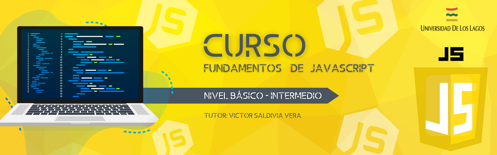

# Repositorio Nivel Básico JavaScript

   
   

## Descripción del Proyecto

Este repositorio es una guía para aquellos que deseen adentrarse en el mundo de la programación en JavaScript desde cero. En este curso, exploraremos los fundamentos de JavaScript, incluyendo conceptos clave como variables, operadores, tipos de datos, ciclos y condicionales. Aprenderemos cómo utilizar estos conceptos para crear programas y aplicaciones interactivas en uno de los lenguajes de programación web más populares y versátiles.

Además de los conceptos teóricos, este curso se enfocará en ejercicios prácticos que te permitirán aplicar lo aprendido y fortalecer tus habilidades de resolución de problemas. A través de desafiantes ejercicios y proyectos, podrás experimentar con el código y ganar confianza en tu capacidad para crear soluciones prácticas.

Ten en cuenta que este repositorio se mantendrá actualizado durante todo el segundo semestre de este año 2023, lo que significa que siempre tendrás acceso a contenido nuevo y relevante a medida que avances en tu aprendizaje.

¡Únete a este curso y comienza tu viaje en la programación en JavaScript hoy mismo!"

## Enlaces de Interés

- Documentación JavaScript [(Información oficial JavaScript)][js]
- Visual Studio Code [(Editor de Texto)][vscode]

[js]: https://developer.mozilla.org/es/docs/Web/JavaScript
[vscode]: https://code.visualstudio.com/download

